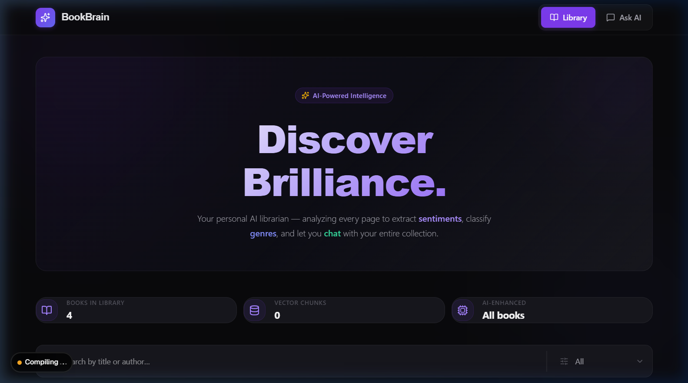
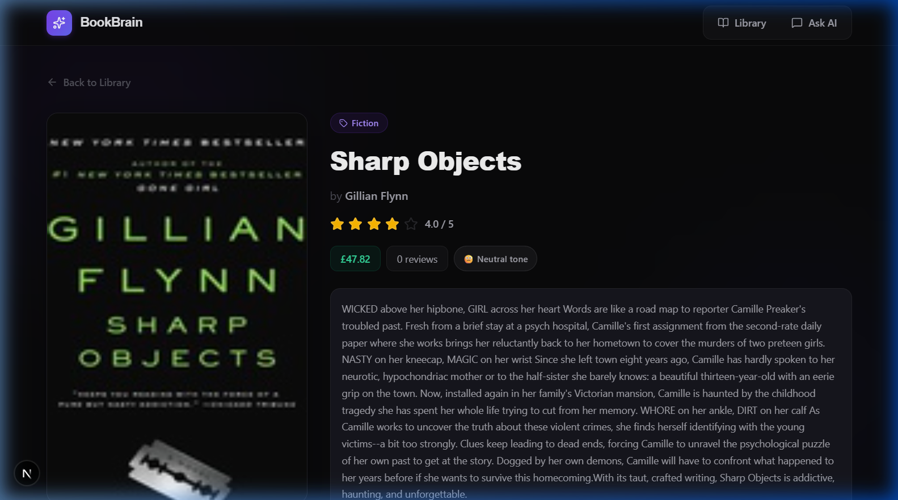
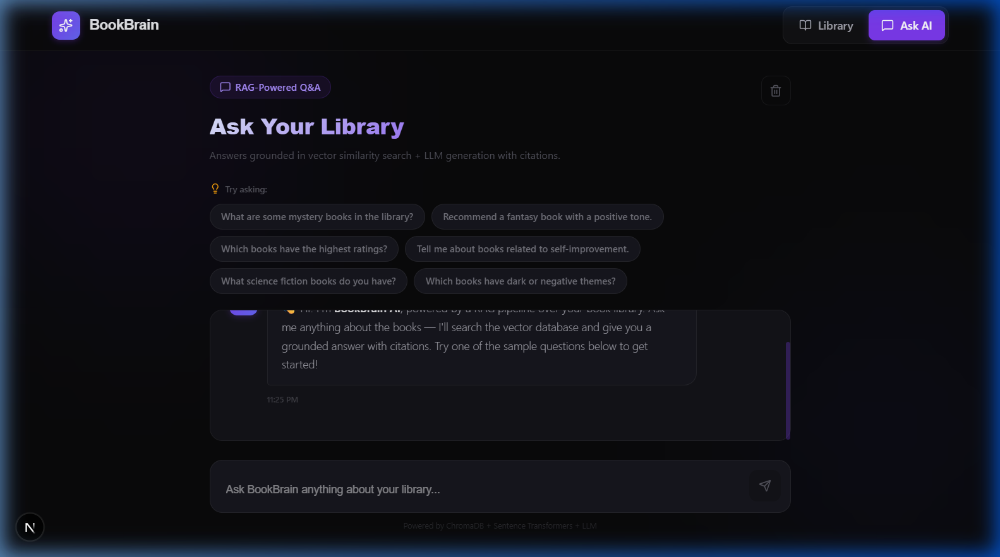

<](#)
[](#)
[](#)
[](#)
[](#)

</div>

---

## 🖼️ Screenshots

<table>
  <tr>
    <td align="center"><strong>Dashboard</strong></td>
    <td align="center"><strong>Book Detail</strong></td>
    <td align="center"><strong>AI Chat</strong></td>
  </tr>
  <tr>
    <td></td>
    <td></td>
    <td></td>
  </tr>
</table>

---

## ✨ Key Features

| Feature | Description |
|---------|-------------|
| 🕷️ **Web Scraper** | Selenium-powered bot scrapes books from `books.toscrape.com` with pagination, caching, and detail-page extraction |
| 🧠 **AI Insights** | Automatic summary generation, genre classification, and sentiment analysis for every book |
| 🔍 **RAG Pipeline** | Ask natural-language questions → FAISS vector similarity search → LLM-generated answers with source citations |
| 📡 **REST API** | 6 fully-documented endpoints via Django REST Framework |
| 🎨 **Modern Frontend** | Next.js 16 + TypeScript with a premium dark UI, animated transitions, and responsive design |
| ⚡ **Smart Caching** | LLM response caching + scraper URL deduplication for efficient re-runs |

---

## 🏗️ Architecture

```
┌──────────────┐     ┌──────────────────────────────────────────────────┐
│              │     │              Django Backend                      │
│   Next.js    │────▶│                                                  │
│   Frontend   │◀────│  REST API ──▶ AI Engine ──▶ OpenAI / LM Studio   │
│              │     │      │            │                              │
└──────────────┘     │      ▼            ▼                              │
                     │  SQLite DB    FAISS Index                        │
┌──────────────┐     │  (metadata)   (vectors)                          │
│   Selenium   │────▶│      │            │                              │
│   Scraper    │     │      └────────────┘                              │
└──────────────┘     └──────────────────────────────────────────────────┘
```

**Data Flow:**
1. **Scraper** visits `books.toscrape.com` → extracts metadata + descriptions → POSTs to backend
2. **Backend** receives book → calls LLM for summary/genre/sentiment → chunks text → embeds via Sentence Transformers → stores in FAISS index
3. **Frontend** queries REST API for book listings, details, and RAG-based Q&A

---

## 🛠️ Tech Stack

| Layer | Technology | Purpose |
|-------|-----------|---------|
| **Backend** | Django 4.2 + DRF | REST API, data models, business logic |
| **Database** | SQLite (default) / MySQL | Book metadata storage |
| **Vector DB** | FAISS (persistent, cosine similarity) | Semantic similarity search |
| **Embeddings** | `all-MiniLM-L6-v2` | 384-dim sentence embeddings via Sentence Transformers |
| **LLM** | OpenAI API / LM Studio | Summary, genre, sentiment, RAG answers |
| **Scraper** | Selenium 4 + BeautifulSoup | Automated book data extraction |
| **Frontend** | Next.js 16 + TypeScript | Reactive UI with SSR |

---

## ⚙️ Setup & Installation

### Prerequisites

- **Python 3.10+**
- **Node.js 18+**
- **Chrome** (for Selenium WebDriver)
- **[LM Studio](https://lmstudio.ai/)** (recommended, free) **or** an OpenAI API key

### 1. Clone the Repository

```bash
git clone <your-repo-url>
cd document_intelligence
```

### 2. Backend

```bash
# Create virtual environment
python -m venv venv

# Activate it
venv\Scripts\activate          # Windows
# source venv/bin/activate    # macOS / Linux

# Install Python dependencies
pip install -r requirements.txt

# Configure environment variables
cd backend
copy .env.example .env        # Windows
# cp .env.example .env        # macOS / Linux
```

Edit `backend/.env` with your configuration:

```env
# ── LM Studio (local, free) ──────────────────────
OPENAI_API_KEY=lm-studio
OPENAI_BASE_URL=http://localhost:1234/v1
OPENAI_MODEL=local-model       # Match model name in LM Studio

# ── MySQL (optional, SQLite used by default) ──────
# DB_NAME=bookbrain_db
# DB_USER=root
# DB_PASSWORD=your_password
```

```bash
# Apply database migrations
python manage.py migrate

# Start the Django server
python manage.py runserver
```

> **Backend runs at:** http://127.0.0.1:8000

### 3. LM Studio (Recommended)

1. Download [LM Studio](https://lmstudio.ai/)
2. Search & download a model (e.g., `Mistral 7B Instruct`, `Llama 3 8B`)
3. Go to **Local Server** tab → **Start Server**
4. Server runs at `http://localhost:1234/v1`
5. Set the model identifier in your `.env` as `OPENAI_MODEL`

### 4. Run the Scraper

```bash
cd scraper

# Default: scrape 5 pages
python main.py

# Options:
python main.py --pages 10 --headless     # 10 pages, headless Chrome
python main.py --skip-cache              # Force re-upload all books
```

The scraper will open Chrome, navigate `books.toscrape.com`, extract book data, and POST each book to the backend for AI processing.

### 5. Frontend

```bash
cd frontend
npm install
npm run dev
```

> **Frontend runs at:** http://localhost:3000

---

## 📡 API Reference

**Base URL:** `http://127.0.0.1:8000/api/`

### Books

#### `GET /api/books/` — List books

| Parameter | Type | Default | Description |
|-----------|------|---------|-------------|
| `page` | int | 1 | Page number |
| `page_size` | int | 20 | Results per page (max 100) |
| `search` | string | — | Filter by title or author |
| `genre` | string | — | Filter by genre (exact match) |

<details>
<summary><strong>Example Response</strong></summary>

```json
{
  "count": 100,
  "page": 1,
  "page_size": 20,
  "total_pages": 5,
  "results": [
    {
      "id": 1,
      "title": "A Light in the Attic",
      "author": "Shel Silverstein",
      "rating": 4.0,
      "review_count": 0,
      "description": "It's hard to imagine a world without...",
      "book_url": "https://books.toscrape.com/...",
      "cover_image_url": "https://...",
      "genre": "Fiction",
      "summary": "AI-generated summary...",
      "sentiment": "Neutral",
      "price": "£51.77",
      "created_at": "2026-04-18T..."
    }
  ]
}
```

</details>

#### `GET /api/books/<id>/` — Book detail

Returns the full book record including all AI-generated fields.

#### `GET /api/books/<id>/related/` — Related books

Returns up to 5 semantically similar books via FAISS vector search.

<details>
<summary><strong>Example Response</strong></summary>

```json
{
  "book_id": 1,
  "method": "vector_similarity",
  "related": [
    { "id": 3, "title": "Sharp Objects", "genre": "Fiction", "..." : "..." }
  ]
}
```

</details>

---

### Ingestion

#### `POST /api/upload/` — Add a book

Ingests a new book, triggers AI insight generation (summary, genre, sentiment), and indexes into the vector store.

<details>
<summary><strong>Request / Response</strong></summary>

**Request:**
```json
{
  "title": "The Great Gatsby",
  "author": "F. Scott Fitzgerald",
  "description": "A novel about the American Dream...",
  "rating": 4.5,
  "book_url": "https://example.com/gatsby",
  "price": "$12.99"
}
```

**Response:**
```json
{
  "id": 42,
  "title": "The Great Gatsby",
  "created": true,
  "genre": "Fiction",
  "sentiment": "Mixed",
  "summary_preview": "A tale of wealth, love, and disillusionment...",
  "chunks_indexed": 3
}
```

</details>

---

### RAG Chat

#### `POST /api/chat/` — Ask a question

Performs FAISS vector similarity search over all book chunks, retrieves relevant context, and generates an LLM response with source citations.

<details>
<summary><strong>Request / Response</strong></summary>

**Request:**
```json
{
  "question": "What mystery books are in the library?"
}
```

**Response:**
```json
{
  "answer": "Based on the library, mystery books include [Source 1]...",
  "sources": [
    {
      "source_index": 1,
      "book_id": 7,
      "title": "Sharp Objects",
      "chunk": "A gripping mystery set in a small town...",
      "relevance_percent": 91.3
    }
  ]
}
```

</details>

---

### Health

#### `GET /api/health/` — System status

```json
{
  "status": "ok",
  "books_in_db": 100,
  "chunks_in_vector_db": 347
}
```

---

## 💬 RAG in Action — Sample Q&A

| Question | Answer (abbreviated) |
|----------|---------------------|
| "What mystery books are in the library?" | "Mystery titles include **Sharp Objects** [Source 1] — a psychological thriller by Gillian Flynn..." |
| "Recommend a book with a positive tone" | "I'd recommend **A Light in the Attic** [Source 1] — a beloved poetry collection with uplifting themes..." |
| "Which books deal with romance?" | "Romance titles found: **Tipping the Velvet** [Source 1] — a historical romance by Sarah Waters..." |

> Every answer includes clickable source citations that link back to the original book chunks, so you can verify the AI's reasoning.

---

## 📁 Project Structure

```
document_intelligence/
│
├── backend/                         # Django REST Framework backend
│   ├── api/
│   │   ├── models.py                # Book model (title, author, genre, summary, sentiment, etc.)
│   │   ├── serializers.py           # DRF serializers with validation
│   │   ├── views.py                 # API views (list, detail, related, upload, chat, health)
│   │   ├── ai_engine.py             # LLM integration — summary, genre, sentiment, RAG
│   │   ├── vector_store.py          # ChromaDB manager — chunking, embedding, similarity search
│   │   └── urls.py                  # URL routing
│   ├── document_intelligence/       # Django project settings
│   ├── manage.py
│   └── .env.example                 # Environment variable template
│
├── frontend/                        # Next.js 16 + TypeScript
│   └── src/
│       ├── app/
│       │   ├── page.tsx             # Dashboard — hero, stats, book grid, search/filter
│       │   ├── book/[id]/page.tsx   # Book detail — cover, metadata, AI insights, related
│       │   └── chat/page.tsx        # RAG Q&A — chat interface with source citations
│       ├── components/
│       │   ├── Navbar.tsx           # Sticky navigation bar
│       │   ├── BookCard.tsx         # Book card with cover, badges, rating, price
│       │   └── LoadingStates.tsx    # Skeletons, spinners, error/empty states
│       └── lib/
│           └── api.ts              # Typed Axios API client
│
├── scraper/
│   └── main.py                      # Selenium scraper (multi-page, cached, headless mode)
│
├── screenshots/                     # UI screenshots for README
├── requirements.txt                 # Python dependencies
└── .gitignore
```

---

## ✅ Evaluation Criteria Coverage

| Criteria | Status | Implementation |
|----------|--------|----------------|
| RAG Pipeline | ✅ | FAISS similarity search → context injection → LLM answer → source citations |
| AI Insights | ✅ | Auto-generated summary, genre classification, sentiment analysis per book |
| REST API | ✅ | 6 endpoints — list, detail, related, upload, chat, health |
| Selenium Scraper | ✅ | Multi-page scraping with caching, detail page extraction, headless mode |
| Vector Database | ✅ | FAISS with overlapping sliding-window chunks (400 chars, 80 overlap) |
| Frontend | ✅ | Next.js 16 + TypeScript — dark theme with premium design |
| Caching | ✅ | LLM response cache + scraper URL deduplication |
| Smart Chunking | ✅ | Overlapping sliding-window strategy for better retrieval recall |

---

## 📦 Key Dependencies

**Python** (see `requirements.txt`):
- `Django==4.2.13`, `djangorestframework==3.15.2` — Backend framework
- `faiss-cpu==1.13.2`, `sentence-transformers==2.7.0` — Vector search + embeddings
- `openai==1.30.1` — LLM client (OpenAI / LM Studio compatible)
- `selenium==4.20.0`, `webdriver-manager==4.0.1` — Web scraping
- `torch==2.3.0` — ML runtime for Sentence Transformers

**JavaScript** (see `frontend/package.json`):
- `next@16`, `react@19`, `typescript@5` — Frontend framework
- `axios` — HTTP client
- `lucide-react` — Icon library

---

<div align="center">

Built with ❤️ by Arjun for the Document Intelligence internship assignment

</div>
]]>
